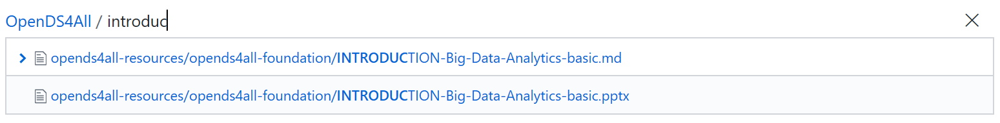
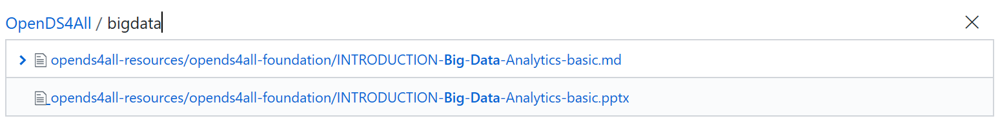
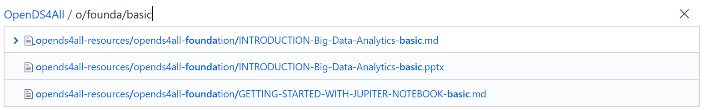
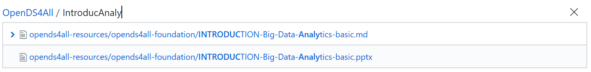
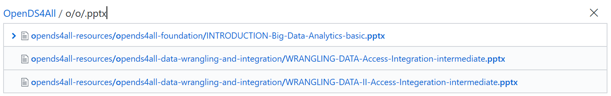

# Naming Conventions for Modules

## Modules are identified by a descriptive name, keywords, skill level and file extension
A module name ( file name ) consists of four parts:
*	__XXX-Yyy-zzz.abc__  
where   
*	__XXX__ represents the descriptive name of the module, e.g.
    *	INTRODUCTION
    *	WRANGLING-DATA
    * UNSUPERVISED-MACHINE-LEARNING  
    ( multiple words in the descriptive name are separated by dashes ‘-‘, with a maximum of 3 words allowed )  
* __Yyy__ represents keywords, e.g.
    * Access-Integration  
    * Big-Data-Analytics
    * Convolutional-Neural-Networks  
    ( multiple keywords are separated by dashes ‘-‘, with a with maximum of 3 keywords allowed )
*	__zzz__ represents the skill level
    *	basic
    *	intermediate
    *	advanced  
    ( the skill level can only have one value )
*	__abc__ represents the file extension, e.g.
    *	txt
    * pptx 
    * md
    * ipynb

__Examples__

* INTRODUCTION-Big-Data-Analytics-basic.pptx  
* INTRODUCTION-Big-Data-Analytics-basic.md  
* WRANGLING-DATA-Access-Integration-intermediate.pptx  
* WRANGLING-DATA-II-Access-Integration-intermediate.pptx 
* SUPERVISED-MACHINE-LEARNING-Neural-Networks-advanced.pptx
* SUPERVISED-MACHINE-LEARNING-Neural-Networks-advanced.txt
* SUPERVISED-MACHINE-LEARNING-Neural-Networks-intermediate.ipynb

The benefit of this naming convention is that modules are searchable on name, keywords, skill level and file extension.

## Searching for Content

The file name is searchable with the standard __Find file__ search functionality already in GitHub 

* Search by descriptive name, e.g. find INTRODUCTION modules

* Search by topic, e.g. find Big Data modules

* Search by skill level inside a category, e.g. basic modules 

* Search by descriptive module name __and__ keyword, e.g. Introduction and Analytics 

* Search across multiple categories starting at a specific level, e.g. find all PowerPoint files

__Comments__

* The dashes in the file names can be ignored when searching, e.g. "bigdata" and "big-data" gives the same result
* Word order is important, e.g. "bigdata" and "databig" gives different results

## Notes

* There is an absolute limit of 260 characters on the length of a file name

