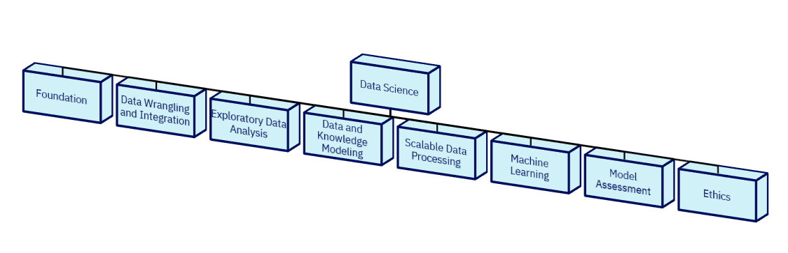

# Description

OpenDS4All is a project created to accelerate the creation of data science curricula at academic institutions. While a great deal of online material is available for data science, **including** online courses, we recognize that the **best** way for many students to learn (and for many institutions to deliver) content is through a combination of lectures, recitation or flipped classroom activities, and hands-on assignments.

OpenDS4All attempts to fill this important niche.  Our goal is to provide recommendations, slide sets, sample Jupyter notebooks, and other materials for creating, customizing, and delivering data science and data engineering education.

The project hosts educational modules that may be used as building blocks for a data science curriculum.

# Audience (Instructor and Student)

The initial modules were designed to target a broad, cross-university audience at both the undergraduate and graduate levels.  Modules contain instructor notes and comments intended to aid in the delivery of the material; the expectation is that instructors will be generally fluent in basic database and machine learning concepts.

The perspective of the materials largely comes from computer science, with an emphasis on data wrangling and engineering as well as machine learning and validation.  However, prior versions of the content have been used to teach students ranging from freshmen to PhD students, across a wide range of fields.  The emphasis is largely on core concepts and algorithms with grounding in today's technologies and best practices.

Students are expected to come in with two major prerequisites:

* Comfort and familiarity with programming in Python (writing small functions, importing and calling library functions, using Python data structures).
* Familiarity with probability theory and very basic statistical notions.

To some extent, students with a limited background *can* follow along with this material, but they will likely need to supplement extensively.

# How to use

The following topology shows how content is __currently__ organized around categories. This is a living/dynamic taxonomy that is updated as new content is added to the project. 

Each category contains modules and each module consists of one or more of the following components:

* instructor notes (`Instructor_Notes.md`) and guide to files
* a set of PowerPoint slides (with presenter notes) ending in `.pptx`
* companion Jupyter notebooks, for students to see the lecture materials "in context" and to be able to experiment
* sample quiz materials (where applicable)
* sample homework assignments (where applicable)
* additional documentation (where applicable)

There are many ways to interact with this repository:

* browse the repository in search of content ( use the '__Find file__' search functionality ) 
* download content (PowerPoint slides, Jupyter notebooks, etc.)
* contribute content ( become a contributor to the project ) 
* become involved in the day-to-day management of the project ( become a committer )
* provide overall direction and leadership to the project ( become a Technical Steering Committee member ) 

The project's [governance principles](GOVERNANCE.md) clarifies the different roles and describes the processes for becoming a contributor, a committer or a TSC member.  

# Contributing

Anyone can contribute to this repository - learn more at [CONTRIBUTING.md](CONTRIBUTING.md). Follow the step-by-step instructions [COMMUNITY-GUIDE.md](COMMUNITY-GUIDE.md) to submit a module for possible inclusion into to repository.

# Governance

OpenDS4All is a project hosted by [ODPi](https://odpi.org). This project has established its own processes for managing day-to-day processes in the project at [GOVERNANCE.md](GOVERNANCE.md).

# Reporting Issues

To report a problem, you can open an [issue](https://github.com/odpi/OpenDS4All/issues). If the issue is sensitive in nature or a security related issue, please do not report in the issue tracker but instead email odpi-opends4all-private@lists.odpi.org.

# Learn More

If you are interested in collaborating on the project, please [sign up](https://cloud.email.thelinuxfoundation.org/ODPi-OpenDS4All).

----
License: [CC BY 4.0](https://creativecommons.org/licenses/by/4.0/),
Copyright Contributors to the ODPi OpenDS4All project.
